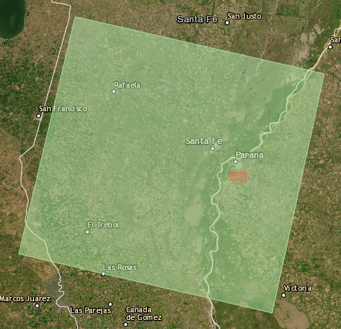

# TIF-Geomatica

## Decisiones

Por la ubicación:

- Path: 227
- Row: 82

La idea es:
Tomar el mismo enfoque y ver si podemos aplicarlo a una sola imagen y luego a otras imagenes de diferentes resolución temporal. Toma una imagen, la expresa en RGB.

-----

## Partes

- [X] Designación del área de estudio
	- [ ] Definir ROI. Substraer de las imagenes la región de interés.
- [X] Obtención de las imagenes
- [ ] Describir las bandas, cada banda para qué es útil. Comparar con Landsat 5 y 8, los rangos y hacer la comparativa. No estaría ma citar y hacer un cuadro comparativo para después extrapolar.
- [ ] Análisis visual. Lo que tiene. Mostrar la imagen en color real
- [ ] No describir el modelo porque ya existe pero si explicar como el modelo se podría aplicar a otro lado, con los datos que tenemos. Si faltan datos reales, no importa, podríamos completar con datos falsos.
- [ ] Obtener índice urbano para obtener la *constante de atracción*. Habiendo obtenido el índice urbano clasificar vivienda si o no, una vez hecha la clasificación puedo calcular como hicieron ellos con la ventana el valor de atracción.
- [ ] Identificar clases de rugosidad
- [ ] Definir si la densidad de mosquitos se tiene en cuenta.
	- [ ] Dentro de las opciones de clasifficación del QGIS tenemos para elegir como clasificar según los vecinos (Maxima Verosimilitud)
	- [ ] En vez de usar la clasificación puedo tomar la de las áreas.
- [ ] Obtener los valores del viento, solo la velocidad.

-----

## Modelo

$$\frac{\partial \rho(P,t)}{\partial t}=\triangledown .(D_R \triangledown \rho)-\triangledown.(\rho D_W V)- \triangledown . (\rho K_H \triangledown H) + \alpha - \beta$$

Donde:

|  Simbolo   | Variable                    | Valor                      |
| :--------: | --------------------------- | -------------------------- |
|   $$P$$    | Densidad de mosquitos       | No homogéneo               |
| $$\alpha$$ | Tasa de nacimientos         | $6 (m²/dia)$               |
| $$\beta$$  | Tasa de muertes             | 0.2                        |
|   $$V$$    | Velocidad Viento Superficie | No homogéneo               |
|  $$K_H$$   | Tensor de atracción         | 100                        |
|   $$H$$    | Campo de atracción          | No homogéneo               |
|  $$D_R$$   | Tensor de difusión          | No homogéneo / ver Tabla 2 |
|  $$D_W$$   | Tensor de rugosidad         | No homogéneo / ver Tabla 2 |

| Clases de Rugosidad del Paisaje | $D_W$ | $D_R$ |
| :-----------------------------: | :---: | :---: |
|              Agua               |   1   |   0   |
|         Suelo Expuesto          |   1   |  0.2  |
|         Vegetación Baja         |  0.7  |  0.3  |
|        Bosques Abiertos         |  0.5  |  0.5  |
|         Selva de Yungas         |  0.3  |  0.7  |

- Todos los tensores son considerados como escalares.
	- $D_R$ y $D_W$ dependen del paisaje, considerándose dependientes de las clases de uso del suelo.
- El campo de atracción es un valor por pixel de un raster de 200x200.
 	- Esto entiendo que es porque usan una ROI de 5.7km por 5.7km, esto con una resolución espacial de 30metros daría 190 píxeles.
	- Yo voy a tener que definir estos tamaños según el área de interés que defina.

El factor de propagación es 150x150 por día.

-----

## TODOs

- [ ] Comenzar informe
	- [ ] Bajar plantilla de latex
	- [ ] Definir secciones en base a lo que hablamos
	- [ ] Comenzar a redactar con lo que ya tengo.

-----

## Referencia
